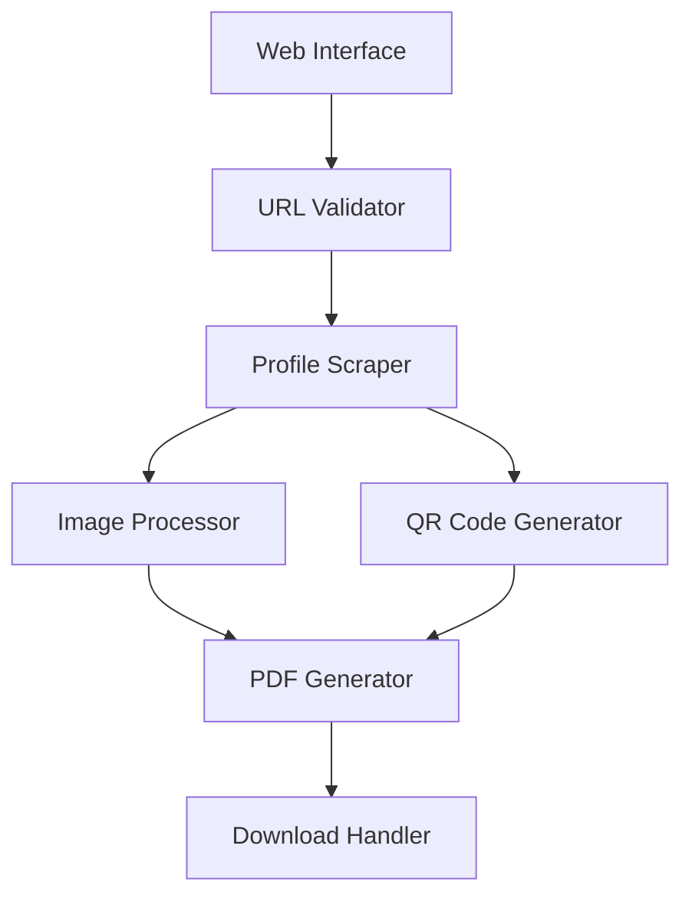

# Design Document

## Overview

The X Profile Name Tag Generator is a web-based tool that creates printable PDF name tags from X (Twitter) profile information. The system extracts user data through web scraping, processes profile images, generates QR codes, and outputs a professionally formatted PDF suitable for printing on standard paper or card stock.

## Architecture

The application follows a modular architecture with clear separation of concerns:



### Core Components:
- **Web Interface**: Simple form for URL input and file download
- **Profile Scraper**: Extracts user data from X profile pages
- **Image Processor**: Downloads and optimizes profile images
- **QR Code Generator**: Creates scannable QR codes
- **PDF Generator**: Combines all elements into a printable document

## Components and Interfaces

### 1. Profile Scraper Module

**Purpose**: Extract user information from X profile pages

**Interface**:
```typescript
interface ProfileData {
  username: string;
  displayName: string;
  profileImageUrl: string;
  profileUrl: string;
}

interface ProfileScraper {
  extractProfile(url: string): Promise<ProfileData>;
  validateUrl(url: string): boolean;
}
```

**Implementation Approach**:
- Use headless browser (Puppeteer/Playwright) to handle JavaScript-rendered content
- Parse DOM elements to extract username, display name, and profile image
- Handle rate limiting and anti-bot measures
- Implement retry logic for network failures

### 2. Image Processor Module

**Purpose**: Download and optimize profile images for name tag use

**Interface**:
```typescript
interface ProcessedImage {
  buffer: Buffer;
  width: number;
  height: number;
  format: string;
}

interface ImageProcessor {
  downloadImage(url: string): Promise<Buffer>;
  processForNameTag(imageBuffer: Buffer): Promise<ProcessedImage>;
  getDefaultImage(): ProcessedImage;
}
```

**Implementation Details**:
- Download images using HTTP client with proper headers
- Resize images to optimal dimensions (e.g., 200x200px)
- Convert to appropriate format (JPEG/PNG)
- Apply circular cropping for professional appearance
- Fallback to default avatar when image unavailable

### 3. QR Code Generator Module

**Purpose**: Generate QR codes linking to X profiles

**Interface**:
```typescript
interface QRCodeOptions {
  size: number;
  errorCorrectionLevel: 'L' | 'M' | 'Q' | 'H';
  margin: number;
}

interface QRCodeGenerator {
  generateQRCode(url: string, options: QRCodeOptions): Promise<Buffer>;
}
```

**Implementation Details**:
- Use established QR code library (qrcode npm package)
- Generate high-resolution QR codes for print quality
- Optimize for scanning distance (medium error correction)
- Output as PNG buffer for PDF embedding

### 4. PDF Generator Module

**Purpose**: Create printable name tag PDFs

**Interface**:
```typescript
interface NameTagData {
  profileData: ProfileData;
  profileImage: ProcessedImage;
  qrCode: Buffer;
}

interface PDFGenerator {
  generateNameTag(data: NameTagData): Promise<Buffer>;
  createFrontSide(data: NameTagData): PDFPage;
  createBackSide(qrCode: Buffer, profileUrl: string): PDFPage;
}
```

**Implementation Details**:
- Use PDF generation library (PDFKit or jsPDF)
- Create dual-page layout (front and back)
- Implement standard name tag dimensions (3.5" x 2.25")
- Include crop marks and fold lines
- Ensure 300 DPI resolution for print quality

## Data Models

### ProfileData Model
```typescript
interface ProfileData {
  username: string;        // @username format
  displayName: string;     // Full display name
  profileImageUrl: string; // URL to profile image
  profileUrl: string;      // Original X profile URL
  extractedAt: Date;       // Timestamp of extraction
}
```

### NameTagConfig Model
```typescript
interface NameTagConfig {
  dimensions: {
    width: number;   // in points (72 points = 1 inch)
    height: number;
  };
  margins: {
    top: number;
    right: number;
    bottom: number;
    left: number;
  };
  fonts: {
    displayName: FontConfig;
    username: FontConfig;
  };
  colors: {
    background: string;
    text: string;
    accent: string;
  };
}
```

## Error Handling

### Error Categories and Responses:

1. **Invalid URL Format**
   - Validation: Regex pattern matching
   - Response: Clear error message with format example
   - Recovery: Allow user to correct input

2. **Profile Not Found/Private**
   - Detection: HTTP 404 or access denied responses
   - Response: Inform user about privacy settings
   - Recovery: Suggest public profile alternatives

3. **Network/Scraping Failures**
   - Detection: Timeout, connection errors, bot detection
   - Response: Retry with exponential backoff
   - Recovery: Fallback to cached data or manual input

4. **Image Processing Errors**
   - Detection: Invalid image format, download failures
   - Response: Use default placeholder image
   - Recovery: Continue with text-only name tag

5. **PDF Generation Errors**
   - Detection: Memory issues, font loading failures
   - Response: Detailed error logging and user notification
   - Recovery: Simplified layout fallback

### Error Response Format:
```typescript
interface ErrorResponse {
  success: false;
  error: {
    code: string;
    message: string;
    details?: any;
    suggestions?: string[];
  };
}
```

## Testing Strategy

### Unit Testing
- **Profile Scraper**: Mock X profile pages, test data extraction
- **Image Processor**: Test image download, resizing, format conversion
- **QR Code Generator**: Verify QR code content and format
- **PDF Generator**: Validate PDF structure and content

### Integration Testing
- **End-to-End Flow**: Complete workflow from URL to PDF
- **Error Scenarios**: Test all error conditions and recovery
- **Performance**: Load testing with multiple concurrent requests

### Manual Testing
- **Print Quality**: Physical printing tests on various paper types
- **QR Code Scanning**: Test QR codes with different scanning apps
- **Cross-Browser**: Verify functionality across browsers
- **Accessibility**: Screen reader and keyboard navigation testing

### Test Data Strategy
- Create mock X profiles for consistent testing
- Use test images of various formats and sizes
- Generate sample PDFs for visual regression testing

## Security Considerations

### Data Privacy
- No persistent storage of user data
- Temporary file cleanup after PDF generation
- No logging of personal information

### Rate Limiting
- Implement request throttling to avoid overwhelming X servers
- Use respectful scraping practices with appropriate delays
- Monitor for and handle anti-bot measures

### Input Validation
- Strict URL validation to prevent injection attacks
- Sanitize all extracted data before PDF generation
- Validate image files before processing

## Performance Optimization

### Caching Strategy
- Cache profile images temporarily during processing
- Reuse QR codes for identical URLs within session
- Cache fonts and PDF templates

### Resource Management
- Limit concurrent scraping operations
- Implement memory cleanup for image processing
- Use streaming for large file operations

### Scalability Considerations
- Stateless design for horizontal scaling
- Async processing for non-blocking operations
- Resource pooling for browser instances