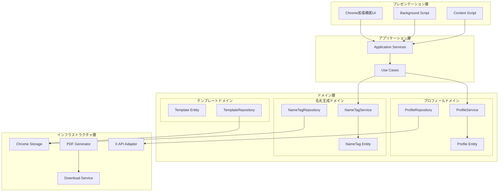
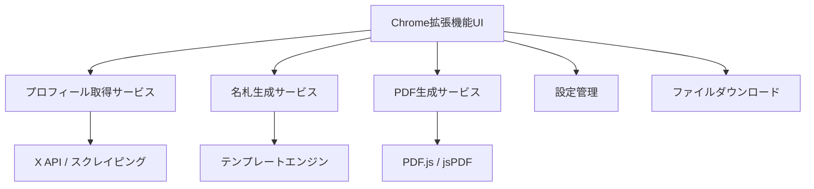

# 設計書

## 概要

XプロフィールリンクからPDF名札を生成するChrome拡張機能の設計書です。この拡張機能は、Xのプロフィール情報を取得し、カスタマイズ可能な名札テンプレートを使用してPDFファイルを生成します。

## アーキテクチャ

### ドメイン駆動設計アーキテクチャ



### システム構成



### 技術スタック

- **フロントエンド**: HTML, CSS, TypeScript
- **Chrome拡張機能**: Manifest V3
- **PDF生成**: jsPDF
- **プロフィール取得**: Fetch API + DOM解析
- **テンプレート**: Canvas API
- **状態管理**: Chrome Storage API

## コンポーネントとインターフェース

### 1. Chrome拡張機能コンポーネント

#### Popup UI (`popup.html`, `popup.ts`)

- プロフィールURL入力フィールド
- 名札設定パネル
- 生成ボタン
- プログレス表示

#### Background Script (`background.ts`)

- 拡張機能の初期化
- コンテキストメニューの管理
- タブ情報の取得

#### Content Script (`content.ts`)

- 現在のXプロフィールページのURL検出
- ページ情報の抽出

### 2. サービスコンポーネント

#### ProfileService

```typescript
interface ProfileService {
  fetchProfile(url: string): Promise<XProfile>;
  fetchMultipleProfiles(urls: string[]): Promise<XProfile[]>;
}

interface XProfile {
  username: string;
  displayName: string;
  profileImage: string;
  bio?: string;
  verified: boolean;
}
```

#### NameTagService

```typescript
interface NameTagService {
  generateNameTag(profile: XProfile, template: NameTagTemplate): Promise<NameTagData>;
  generateMultipleNameTags(profiles: XProfile[], template: NameTagTemplate): Promise<NameTagData[]>;
}

interface NameTagTemplate {
  id: string;
  name: string;
  width: number;
  height: number;
  layout: LayoutConfig;
  styling: StyleConfig;
}

interface NameTagData {
  profile: XProfile;
  canvas: HTMLCanvasElement;
  template: NameTagTemplate;
}
```

#### PDFService

```typescript
interface PDFService {
  generatePDF(nameTags: NameTagData[]): Promise<Blob>;
  downloadPDF(pdfBlob: Blob, filename: string): void;
}
```

### 3. 設定管理

#### SettingsService

```typescript
interface SettingsService {
  getSettings(): Promise<AppSettings>;
  saveSettings(settings: AppSettings): Promise<void>;
}

interface AppSettings {
  defaultTemplate: string;
  fontSize: number;
  fontFamily: string;
  colors: ColorScheme;
  autoDownload: boolean;
}

interface ColorScheme {
  background: string;
  text: string;
  accent: string;
}
```

## データモデル

### プロフィールデータ

```typescript
interface XProfile {
  username: string;          // @username
  displayName: string;       // 表示名
  profileImage: string;      // プロフィール画像URL
  bio?: string;             // プロフィール説明
  verified: boolean;        // 認証済みアカウント
  followerCount?: number;   // フォロワー数
  location?: string;        // 所在地
}
```

### 名札テンプレート

```typescript
interface NameTagTemplate {
  id: string;
  name: string;
  dimensions: {
    width: number;    // mm
    height: number;   // mm
  };
  elements: TemplateElement[];
}

interface TemplateElement {
  type: 'text' | 'image' | 'shape';
  position: { x: number; y: number };
  size: { width: number; height: number };
  styling: ElementStyle;
  content?: string;
  dataBinding?: keyof XProfile;
}
```

### エラーハンドリングモデル

```typescript
interface APIError {
  code: string;
  message: string;
  details?: any;
}

enum ErrorCodes {
  PROFILE_NOT_FOUND = 'PROFILE_NOT_FOUND',
  NETWORK_ERROR = 'NETWORK_ERROR',
  RATE_LIMITED = 'RATE_LIMITED',
  PDF_GENERATION_FAILED = 'PDF_GENERATION_FAILED',
  INVALID_URL = 'INVALID_URL'
}
```

## エラーハンドリング

### エラー処理戦略

1. **プロフィール取得エラー**
   - 無効なURL: ユーザーに分かりやすいエラーメッセージを表示
   - ネットワークエラー: 再試行オプションを提供
   - レート制限: 待機時間を表示し、自動再試行

2. **PDF生成エラー**
   - メモリ不足: バッチサイズを削減して再試行
   - テンプレートエラー: デフォルトテンプレートにフォールバック

3. **一括処理エラー**
   - 部分的失敗: 成功した分のみでPDF生成を継続
   - エラーレポート: 失敗したURLとエラー理由を表示

### エラー表示

```typescript
interface ErrorDisplay {
  showError(error: APIError): void;
  showWarning(message: string): void;
  showRetryOption(callback: () => void): void;
}
```

## テスト戦略

### 単体テスト

- ProfileService: プロフィール取得ロジック
- NameTagService: 名札生成ロジック
- PDFService: PDF生成機能
- SettingsService: 設定の保存・読み込み

### 統合テスト

- Chrome拡張機能のポップアップ動作
- バックグラウンドスクリプトとの連携
- ファイルダウンロード機能

### E2Eテスト

- 実際のXプロフィールURLでの名札生成
- 複数プロフィールの一括処理
- 異なるテンプレートでの生成

### テストデータ

```typescript
const mockProfiles: XProfile[] = [
  {
    username: 'testuser1',
    displayName: 'テストユーザー1',
    profileImage: 'data:image/png;base64,...',
    bio: 'テスト用のプロフィールです',
    verified: false
  }
];
```

## セキュリティ考慮事項

### データプライバシー

- プロフィール情報の一時的な保存のみ
- ローカルストレージの暗号化
- 不要なデータの自動削除

### API制限

- レート制限の遵守
- 適切なUser-Agentの設定
- エラー時の指数バックオフ

### Chrome拡張機能セキュリティ

- Manifest V3の使用
- 最小権限の原則
- Content Security Policy の適用

## パフォーマンス最適化

### 画像処理

- プロフィール画像のキャッシュ
- 画像サイズの最適化
- 遅延読み込み

### PDF生成

- Canvas要素の再利用
- メモリ使用量の監視
- バッチ処理のサイズ制限

### ネットワーク

- 並列リクエストの制限
- タイムアウト設定
- 失敗時の再試行戦略